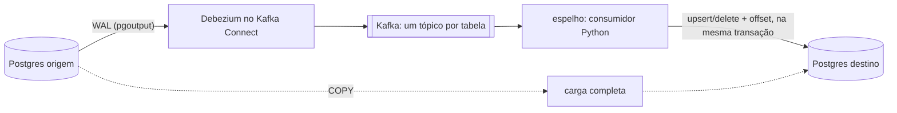

# cdc-kafka-postgres

[](https://github.com/BrunoMaia23/cdc-kafka-postgres/actions/workflows/ci.yml)

Replicação contínua de tabelas entre dois bancos com Debezium e Kafka, e um consumidor em Python que
aplica cada mudança no destino. Montei este repositório a partir de um projeto do trabalho para
substituir um serviço gerenciado de replicação (o AWS DMS) por uma solução nossa. Lá a origem é um
Oracle; aqui ela é um Postgres, para tudo rodar com um `docker compose up`. Os dados são fictícios e o
código foi escrito do zero.

*In English: Postgres → Debezium → Kafka → Python → Postgres. The consumer keeps the Kafka offsets in
the target database, in the same transaction as the data, so a crash never duplicates or loses an
event. Synthetic data; the whole stack runs with docker compose.*

## Rodando

Precisa de Docker e Python 3.10 a 3.13.

```bash
docker compose up -d --wait
python -m venv .venv && source .venv/bin/activate   # Windows: .venv\Scripts\activate
pip install -e ".[dev]"
python -m espelho demo
```

A demo cria uma loja fictícia na origem, registra o conector, espelha tudo, faz uma rajada de
alterações, espelha de novo e compara as duas pontas tabela por tabela. Para repetir do zero, rode
`docker compose down -v` e suba a stack de novo.

```
[origem]       tabelas criadas com dados fictícios: cliente 40, produto 25, pedido 60, item_pedido 148, evento_site 300
[destino]      schema espelho com 5 tabelas e o controle em _cdc
[conector]     loja-origem rodando, snapshot inicial de 4 tabelas
[carga]        evento_site 300 linhas por COPY
[cdc]          273 eventos aplicados (cliente 40, produto 25, pedido 60, item_pedido 148), 0 com erro, 0 tombstones, lag 0
[origem]       alterações: insert 14, update 20, delete 5
[cdc]          83 eventos aplicados (cliente 11, produto 8, pedido 21, item_pedido 43), 0 com erro, 14 tombstones, lag 0
[carga]        evento_site 350 linhas por COPY
   cliente      origem   41 | destino   41 | igual
   produto      origem   25 | destino   25 | igual
   pedido       origem   68 | destino   68 | igual
   item_pedido  origem  175 | destino  175 | igual
   evento_site  origem  350 | destino  350 | igual
[reconciliação] origem e destino iguais nas 5 tabelas
[reinício]     consumidor rodou de novo e aplicou 0 eventos (o ponto de partida vem dos offsets gravados no destino)
```

Os 14 tombstones são os que o Debezium publica depois de cada delete, para o Kafka poder compactar o
tópico. O consumidor só avança o offset neles.

## Como funciona



Tudo sai do `catalogo.json`: a lista de tabelas, a chave de cada uma e a estratégia. A configuração do
conector também é gerada a partir dele, então incluir uma tabela é uma linha no catálogo.

A loja tem os três tipos de tabela que aparecem num banco de verdade:

- `cliente`, `pedido` e `item_pedido` têm chave primária (a de `item_pedido` é composta). Vão por CDC
  e o consumidor faz upsert ou delete pela chave.
- `produto` não tem chave primária, só um índice único em `sku`. Com `REPLICA IDENTITY USING INDEX`
  na origem e `message.key.columns` no conector, ela também vai por CDC. No destino o `sku` vira chave
  primária.
- `evento_site` não tem chave nenhuma. Update e delete não teriam como ser aplicados, então ela é
  recopiada inteira por `COPY`, com o `TRUNCATE` e a carga na mesma transação.

O ponto principal é onde fica o offset do Kafka. O consumidor não confirma nada no Kafka: ele grava o
próximo offset de cada partição numa tabela do próprio destino (`_cdc.offsets`), dentro da transação
do lote. Se o processo cair no meio, o rollback leva os dados e o offset juntos, e a próxima execução
relê a partir do último ponto confirmado. Como a aplicação é por chave, reprocessar um trecho também
não estraga nada.

Cada evento roda num savepoint. Um evento que não dá para aplicar (valor do tipo errado, coluna que o
destino não conhece) vai para `_cdc.erros` com a mensagem original, e o resto do lote segue.

As mensagens vão sem schema, então quem diz como ler cada valor é a coluna de destino: timestamp chega
em micro ou milissegundos conforme a precisão, `date` em dias desde 1970 e `numeric` como texto. Isso
fica em `tipos.py`, com um teste para cada caso.

## Algumas decisões

Usei um consumidor próprio em vez do JDBC Sink do Kafka Connect. O sink não lida com tópico sem
schema, e o que eu precisava controlar (offset no destino, savepoint por evento, troca de chave
natural, conversão por coluna) ficou mais simples em Python.

Quando o `sku` de um produto muda, a linha antiga tem que sair do destino. O consumidor compara a
chave do `before` com a do `after` e, se mudou, apaga a antiga antes do upsert. A demo faz essa troca
de propósito, e também apaga e recria o mesmo cliente dentro da mesma rajada.

A reconciliação não fica só na contagem: compara também um hash das linhas na ordem da chave,
calculado no próprio banco dos dois lados. Contagem igual com conteúdo diferente acontece mais do que
parece.

## No projeto real

- A origem é Oracle, lida pelo conector Oracle do Debezium com LogMiner. Isso pede supplemental
  logging na origem, que faz o papel do `REPLICA IDENTITY` daqui, inclusive nas tabelas sem chave
  primária que vão por chave natural.
- A carga inicial das tabelas grandes é feita por `COPY`, com um processo por partição.
- São dezenas de tabelas, e o catálogo segue a mesma ideia, com mais campos.
- Lag e erros são acompanhados com Prometheus e Grafana.

## Testes

`pytest` roda os testes de unidade (eventos, tipos, SQL, catálogo e configuração do conector) sem
precisar de banco nem de Kafka.

Com a stack no ar, `pytest -m integracao` roda um cenário ponta a ponta com conector, slot e schema
próprios, então não atrapalha a demo:

1. derruba o consumidor no meio do primeiro lote e confere que nada ficou no destino;
2. publica um evento malformado no meio de alterações normais e confere que só ele foi para
   `_cdc.erros`;
3. reinicia o consumidor e confere que nada é reaplicado.

O CI roda os dois, o de integração com o docker-compose.

## Arquivos

```
src/espelho/
  catalogo.json      tabelas, chaves e estratégia
  catalogo.py        leitura e validação do catálogo
  conector.py        configuração do Debezium e registro no Kafka Connect
  eventos.py         evento do Debezium -> upsert/delete
  tipos.py           conversão dos valores pela coluna de destino
  sql.py             SQL do destino
  destino.py         tabelas espelho, offsets e aplicação do lote
  consumidor.py      leitura do Kafka em lotes
  carga_completa.py  COPY das tabelas sem chave
  reconciliacao.py   contagem e hash, origem x destino
  dados.py           loja fictícia e rajada de alterações
  cli.py             comandos e demo
```
